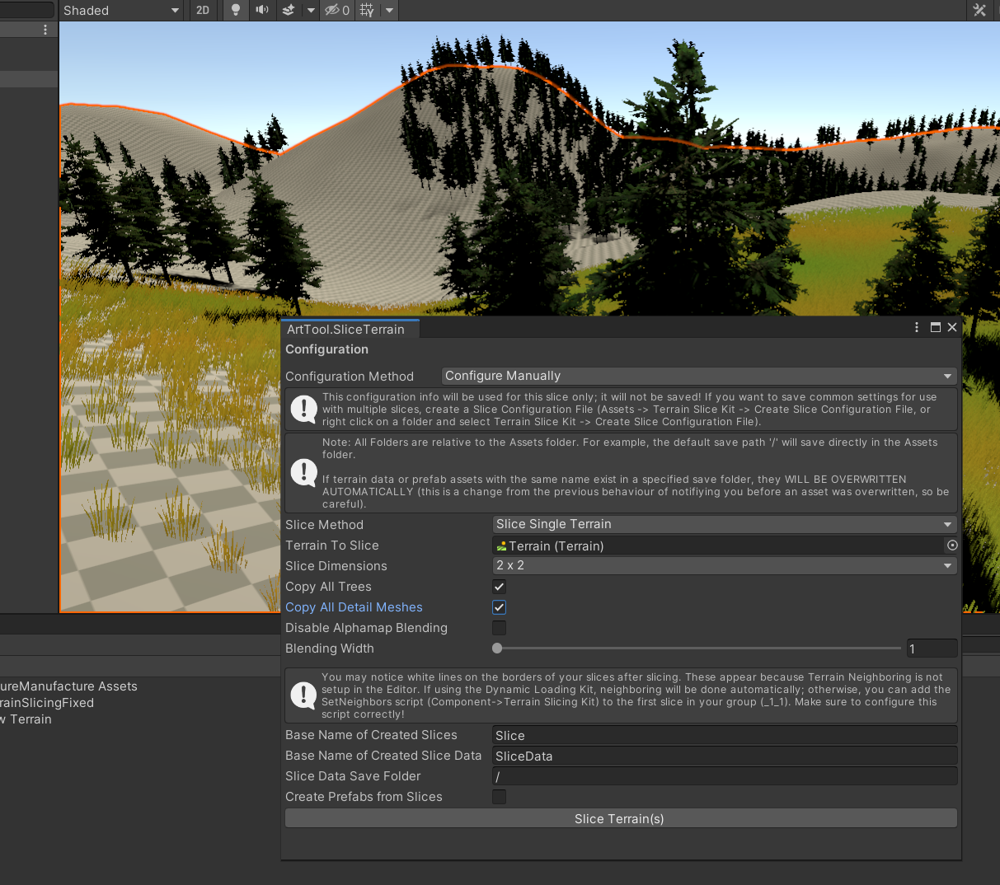
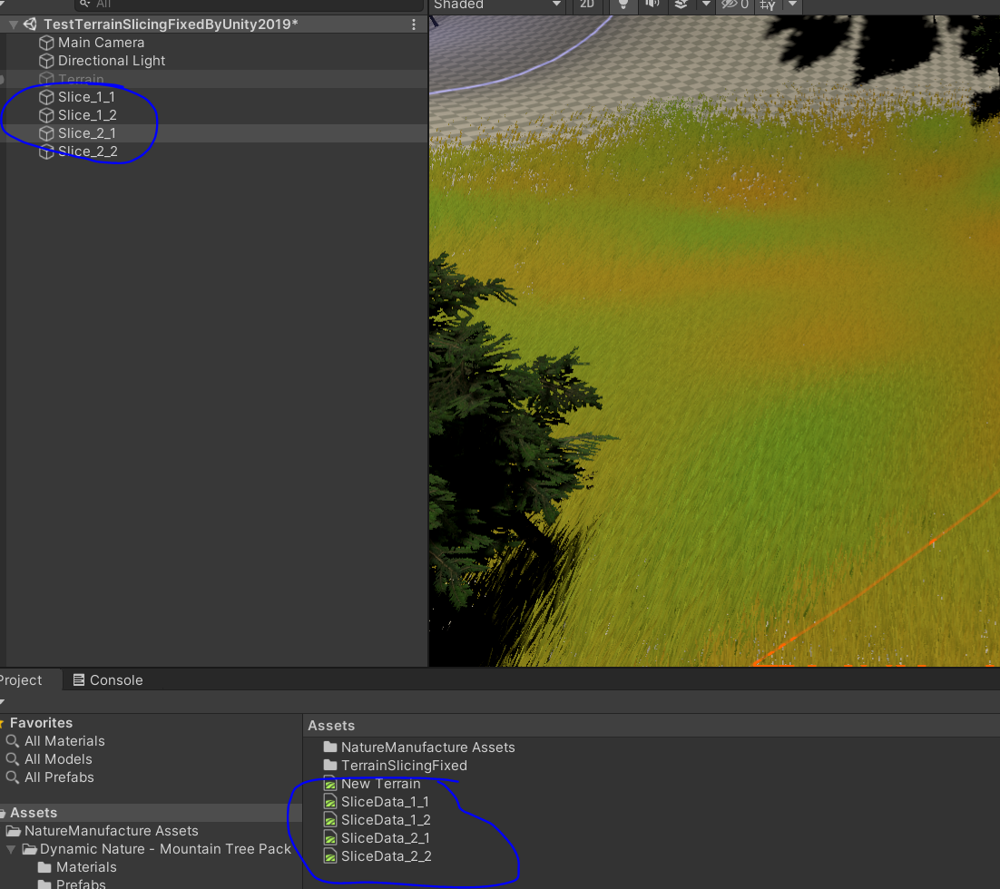

# ArtToolProjrct
记录自己使用Unity美术工具存档。还在更新...

Unity工程目录Assets

- [ ] NatureManufacture Assets（环境资源）
- [ ] TerrainSlicingFixed（地形切割）

## 1、地形切割

改自[插件](https://assetstore.unity.com/packages/tools/terrain/terrain-slicing-dynamic-loading-kit-5982?_ga=2.66209454.1627828120.1638160906-376961199.1630546233#description)。（感谢并请支持正版）在此插件4.0的版本之上做了优化：

- 只保留了地形切割，去除了**动态加载**等其他功能。（项目有自己的加载框架）
- 兼容了Unity2018.4.24和Unity2019.4.18版本以上更高版本。

。。。

